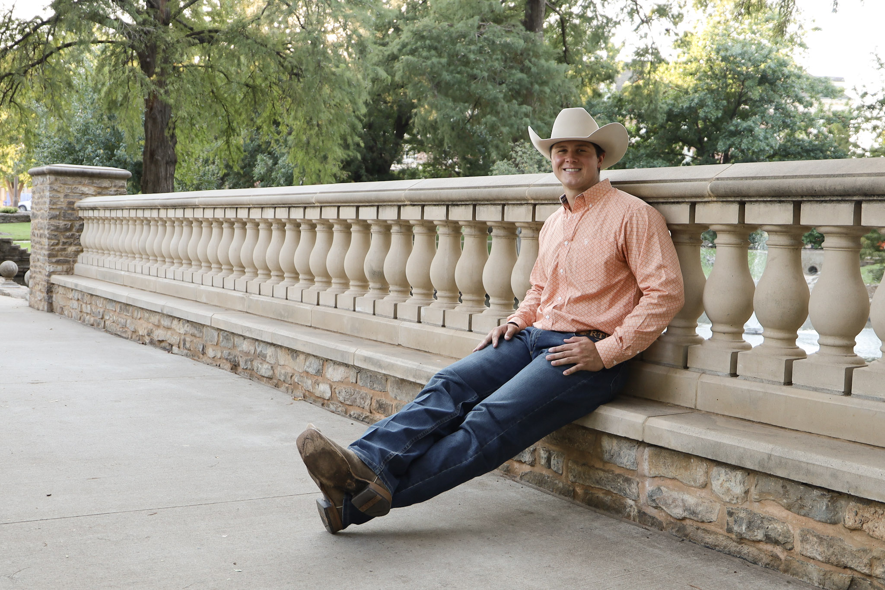
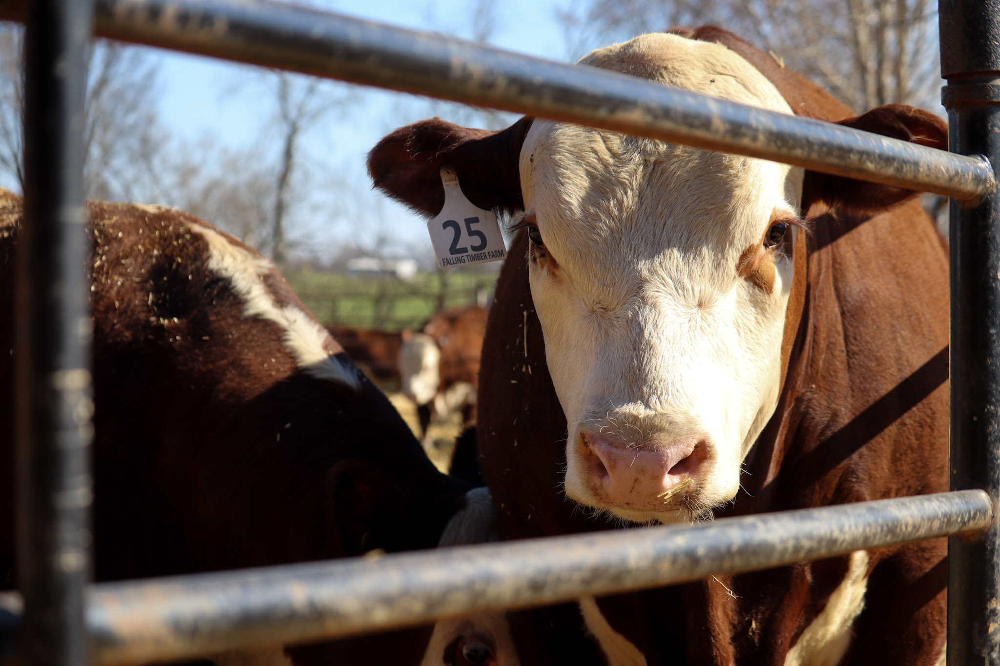
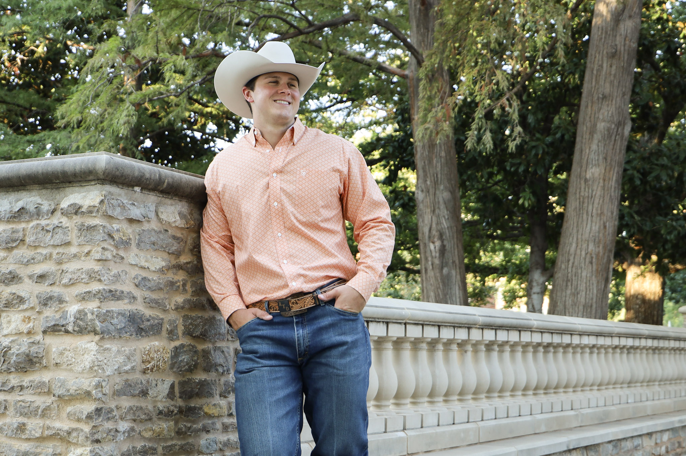
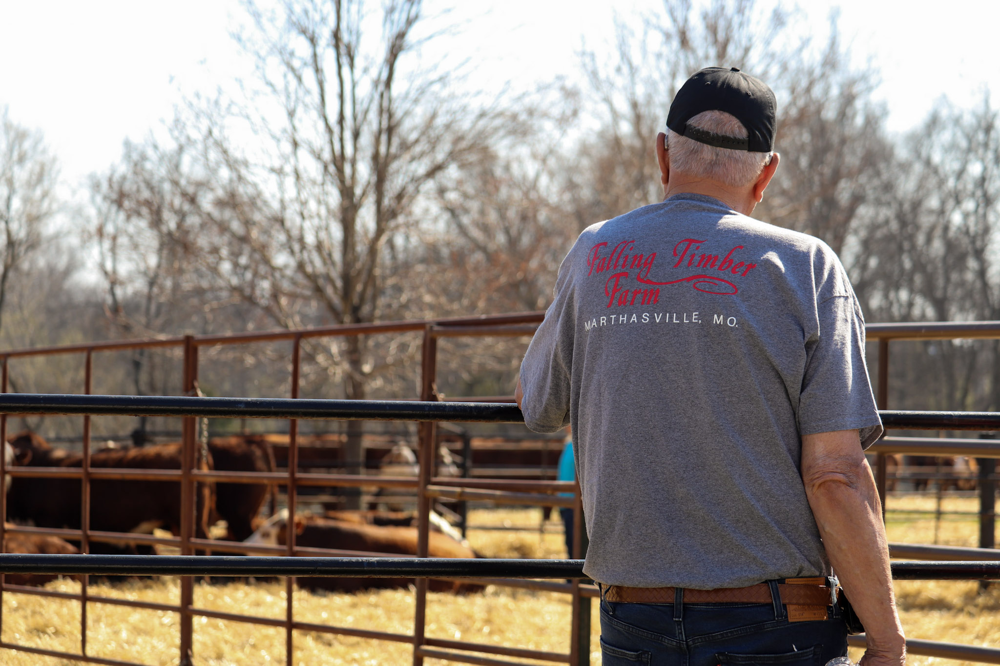
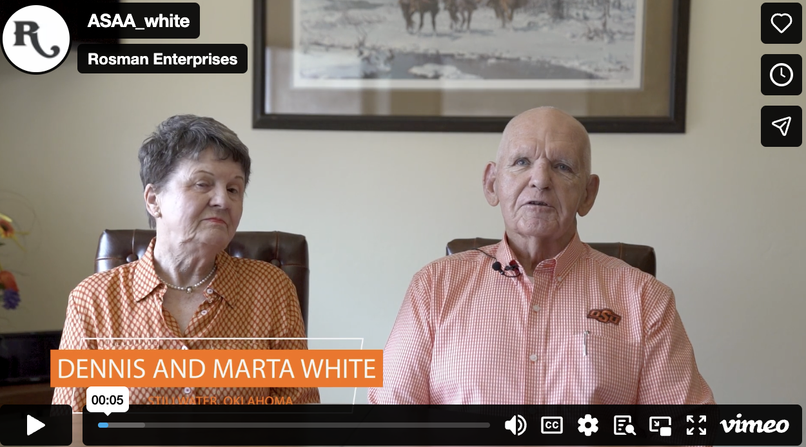
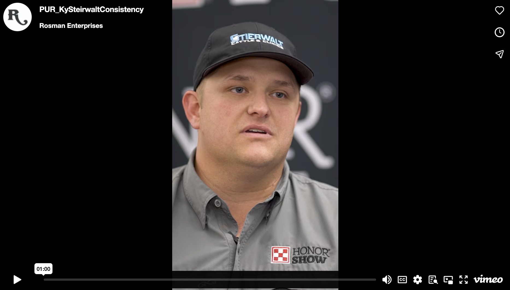

## Photography

From senior sessions to event coverage to nature, I enjoy having a camera in hand in many scenarios. Each image tells a story, and below are a couple I would like to share!

{width="335"}

{width="339"}

{width="337"}

{width="336"}

## Videography

Video work holds a special place in my heart - I believe it truly is the most effective and touching way to tell your story to others. Working with the Oklahoma Youth Expo, OSU Animal Science Alumni Association, and the American Meat Science Association, I've learned the importance of producing quality content that consumers can connect with.

**OSU ASAA Totusek Chairback Honorees - Dennis and Marta White**

**Purina Honor Show - Social Media Vertical**
